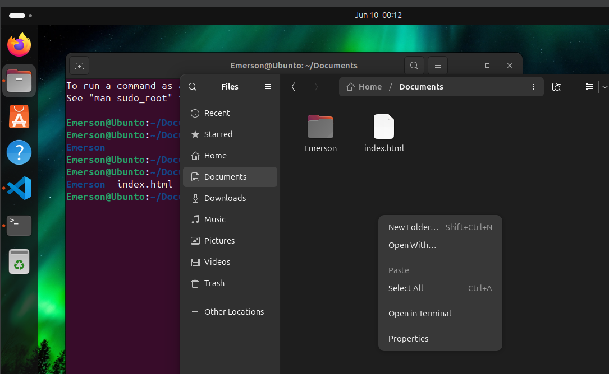

# UC4_PublicarAplicacaoWeb

# Linux

Fazer a instalação do Linux.

Utilizar VirtualBox para poder criar uma nova máquina.

Como configurar e instalar o Linux.

### Seleciona Novo.

Selecionar os dados da máquina, onde será salvo e a localização do disco da ISO

### Dados de configuração.

Criar um usuário e senha.
Usuário: Emerson
Senha: 1406

### Selecionar o dados da Máquina

Determinar a quantidade de mémoria e CPU, usar uma quantidade que não intefira na quantidade de rede.

### Quantidade de HD

Quantidade Discao para selecionar.

## Mostra o padrão da Máquina montada

### Finalizado e Inicial

Ápos a finalização, iniciará a instalação do Ubunto.

### para acessar as pasta no Linux.

Tem que fazer a utilização do / para selecinar o caminho escolhido.

Para acessar a linha de comando, botão direito no mouse Open in Terminar

# Ver linhas de comando.

Envia por PDF.

# Instalação

Utilizar comando.

- sudo apt update

- sudo apt install apache2

Se der erro tentar a baixo a opção.

- sudo usermod -aG sudo Emerson

Antes da opção de Intall, solicitou para fazer a configuração.

- sudo dpkg --configure -a

depois rodar o intall.

## Apos instalação do Apache

Acessa a internet pelo navegador, e digitar o endereço 127.0.0.1

# Para clocar um Repositorio

Vai no Git e veja qual é o caminho, por exemplo.

`https://github.com/Emerdcp/UC2_DesenvolverAplicacoesWebsites`

Depois no Linux vai na Pasta 

01. `HOME` clica para voltar. 
02. `Ubunto/var/www/html`.
03. Clicar com botão direito e abrir o **Terminal**
04. Digitar comando `sudo git clone https://github.com/emerdcp/UC2_DesenvolveraplicacoesWebsites`
    O diretorio para poder clocar.
05. Agora só abrir no navegador.
    localhost/UC2_DesenvolverAplicacoesWebsites/2025.05.05_siteloja

