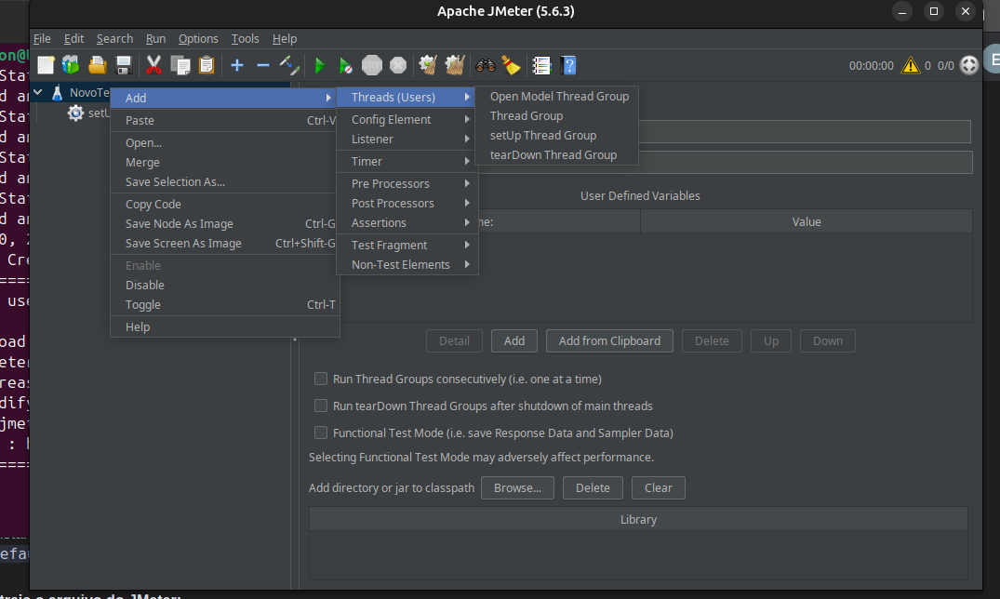
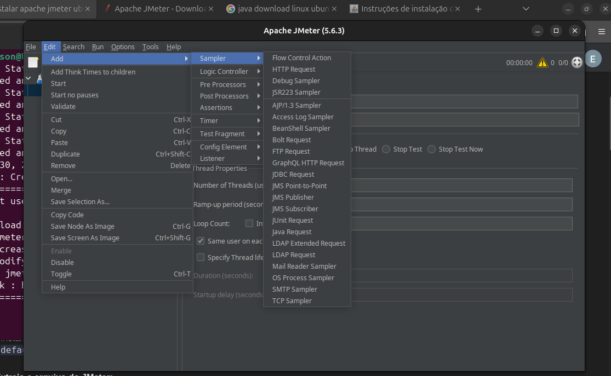
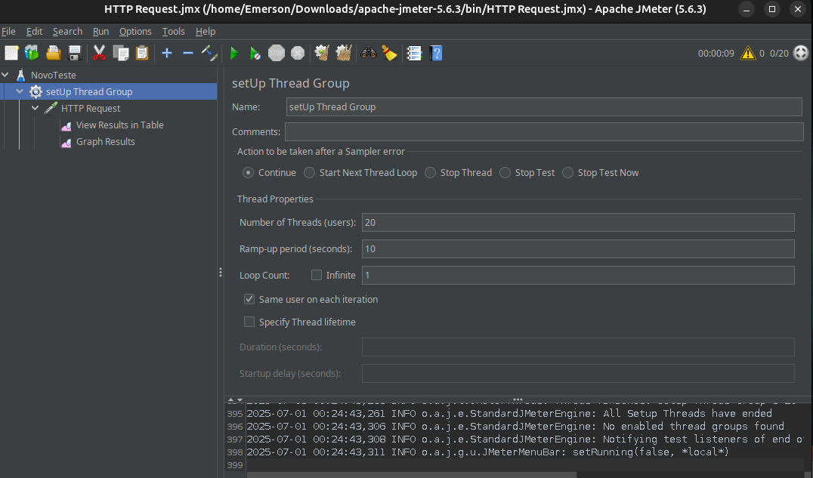
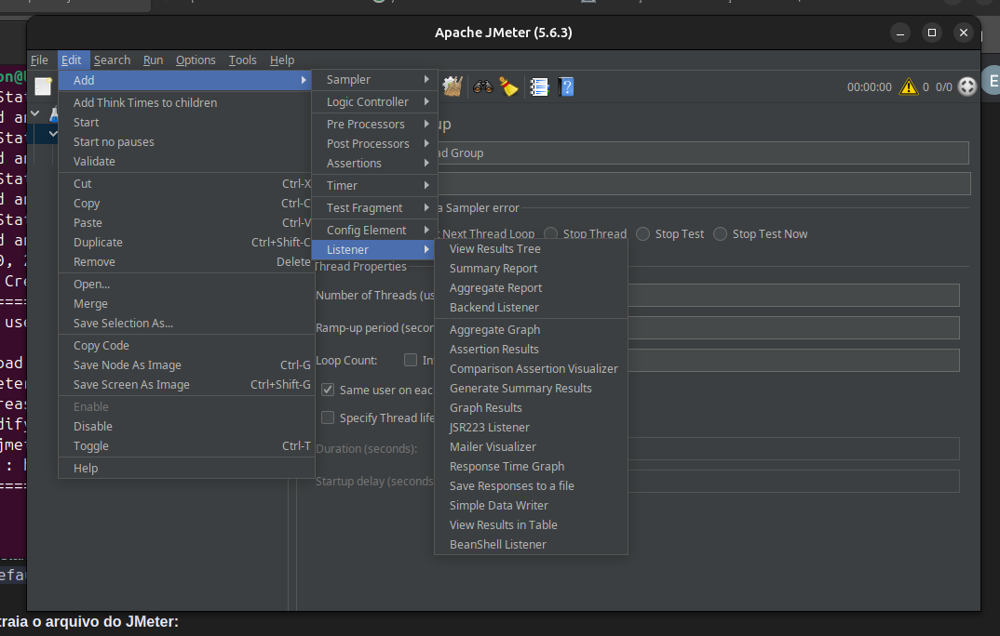
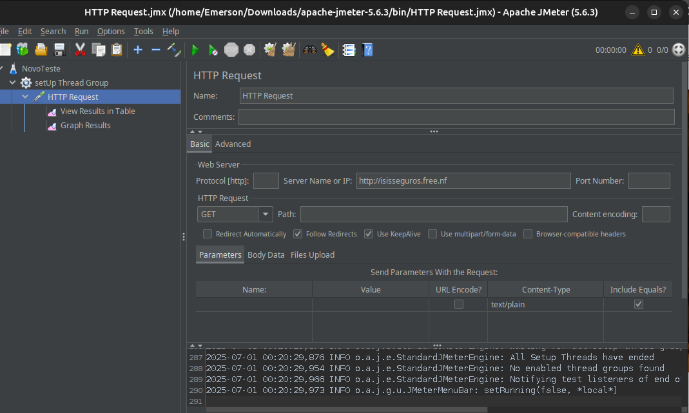

# Sites apresentados na aula 30/06

- (site)Page Speed Insight ⇒ desempenho
[PageSpeed Insights](https://pagespeed.web.dev/)

- (site)GTmetrix ⇒ desempenho:
[GTmetrix | Website Performance Testing and Monitoring](https://gtmetrix.com/)

- (site)WebPagetest ⇒ desempenho:
https://www.cookieyes.com/cookie-consent-cmp/?utm_source=google&utm_medium=cpc&utm_campaign=search_branded_row&utm_content=em_branded_row&utm_term=cookieyes&gad_source=1&gad_campaignid=21638946392&gbraid=0AAAAACsJrke0ndFprPmYWVnF8lQb3fc32&gclid=Cj0KCQjw64jDBhDXARIsABkk8J7Vs_IgDjwD8V77qk1P8lCAxIsMErhksE8HR0Y35TyXK7hWSvzCjDYaAv3JEALw_wcB

- pingdom => desempenho:
[Pingdom Tools](https://tools.pingdom.com/)

- sucuri: segurança do site
[Sucuri Security => segurança do site](https://sitecheck.sucuri.net/)

- cookieyes ⇒ aviso de cookies automatizado(wordpress):
[Cookie Consent Management Platform - CookieYes](https://www.cookieyes.com/cookie-consent-cmp/?utm_source=google&utm_medium=cpc&utm_campaign=search_branded_row&utm_content=em_branded_row&utm_term=cookieyes&gad_source=1&gad_campaignid=21638946392&gbraid=0AAAAACsJrke0ndFprPmYWVnF8lQb3fc32&gclid=Cj0KCQjw64jDBhDXARIsABkk8J7Vs_IgDjwD8V77qk1P8lCAxIsMErhksE8HR0Y35TyXK7hWSvzCjDYaAv3JEALw_wcB)

- Termify = aviso de cookies (html/css):
https://termify.io/

 

# Para fazer instalação do Apche

Acessar o Site https://jmeter.apache.org/download_jmeter.cgi e baixar o arquivo em .zip

## instalar o Java.

Realizar a instalação do Java

## seguir os passo para instalação do Apche

Passos detalhados:

# 1.Verifique se o Java está instalado:
Execute java -version no terminal. Se o Java estiver instalado, você verá a versão. Caso contrário, instale o Java seguindo as instruções abaixo. 

# 2.Instale o Java (se necessário):
- Instalação padrão: 
sudo apt update seguido de sudo apt install default-jre ou sudo apt install default-jdk. 

- Instalação de uma versão específica: 
Use o add-apt-repository ppa:openjdk-r/ppa seguido de sudo apt update e sudo apt install openjdk-11-jdk (ou a versão desejada). 

- Configure a variável de ambiente JAVA_HOME (opcional, mas recomendado): Adicione export JAVA_HOME=$(dirname $(dirname $(readlink -f $(which java)))) ao seu arquivo .bashrc ou .zshrc e execute source ~/.bashrc ou source ~/.zshrc. 

# 3.Baixe o Apache JMeter:
- Acesse o site oficial do Apache JMeter e baixe a versão binária (zip ou tgz). 

# 4Extraia o arquivo:
- Vá para o diretório onde o arquivo foi baixado e use tar -xf apache-jmeter-[versão].tgz (ou unzip apache-jmeter-[versão].zip para arquivos zip) para extraí-lo. 

# 5.Mova a pasta extraída para um local desejado:
Por exemplo, você pode movê-la para /opt/ ou ~/. 

# 6.Navegue até o diretório bin:
Dentro da pasta do JMeter, acesse o diretório bin.

# 7.Execute o JMeter:
Para executar o JMeter na interface gráfica, use ./jmeter.sh (ou ./jmeter.bat no Windows). 
Para executar o JMeter em modo não-GUI (para testes automatizados, por exemplo), use ./jmeter -n -t [nome_do_seu_teste.jmx] -l [arquivo_de_log.jtl]. 

# Outro.

Abrir a opção da pasta bin já extraida, e abrir o terminal.
digitar: ./jmeter.sh

# Após abrir o programa.

Inicia um novo teste.

Para iniciar o teste vai em HTTP Request.

Quando colocar o Setup Thred Group, tem que colocar o teste a quantidade de tempo e usuário de teste.

Depois de clicar em grup novamente add novamente um listener, e selecione grafico, como quer que apareça.

Colocar o site que deseja analisar, e cricar em executar

